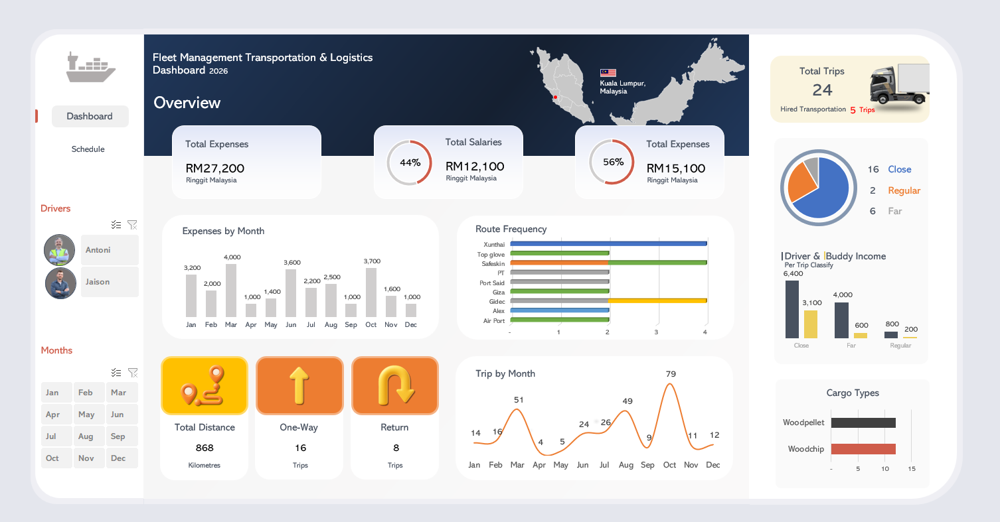

# 🚛 Fleet Operations Performance Analytics

## 📌 Business Problem

Transportation and logistics companies manage large volumes of trip scheduling and fleet utilisation data.
Without structured analysis, management may face challenges in:

* Monitoring trip demand trends
* Identifying high-frequency routes
* Evaluating driver workload distribution
* Improving operational efficiency

This project demonstrates how Excel dashboards can transform raw logistics data into actionable operational insights.

---

## 📊 Dashboard Preview

📂 **Open Interactive Dashboard (Excel File):**
👉 [Click here to view or download the Fleet Analytics Dashboard](Fleet Management Transportation & Logistics.xlsx)

---

## ⚙️ Tools & Techniques Used

### Data Preparation

* Data cleaning and formatting using Microsoft Excel
* Structuring trip schedules for analysis
* Categorising fleet activity by month and driver

### Data Analysis

* Pivot Tables for summarising fleet trips
* Monthly trip trend analysis
* Route frequency evaluation
* Driver workload comparison

### Data Visualisation

* Interactive charts
* Dashboard KPI indicators
* Slicer filters for driver and month analysis
* Executive-style dashboard layout

---

## 📈 Key Performance Indicators (KPIs)

* Total Trips Completed
* Trips by Month Trend
* Top Route Frequency
* Driver Schedule Distribution
* Fleet Utilisation Patterns

---

## 💡 Key Insights

* Certain routes show significantly higher trip frequency indicating heavy operational reliance
* Monthly analysis highlights peak logistics demand periods
* Dashboard filtering enables management to assess driver scheduling efficiency

---

## 🎯 Business Value

This analytics dashboard supports:

1. Improved fleet planning
2. Better route allocation decisions
3. Monitoring driver workload balance
4. Data-driven logistics management

---

## 📂 Repository Structure

fleet-operations-performance-analytics
│
├── Fleet Management Transportation & Logistics.xlsx
├── Fleet_Management_Dashboard.png
└── README.md

---

## 🚀 Future Improvements

* Develop Tableau version of dashboard
* Integrate SQL database for automated reporting
* Implement predictive analytics for trip demand forecasting

---

## 👤 Author

Muhammad Syakir
Aspiring Data Analyst
